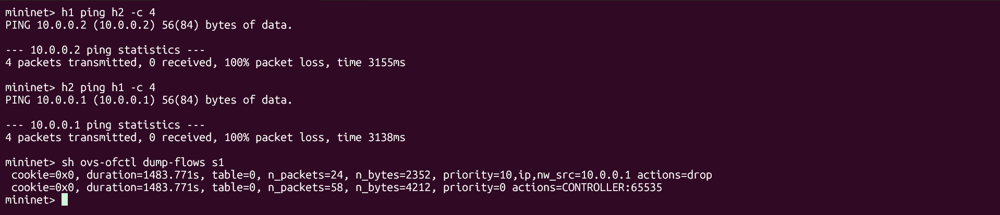
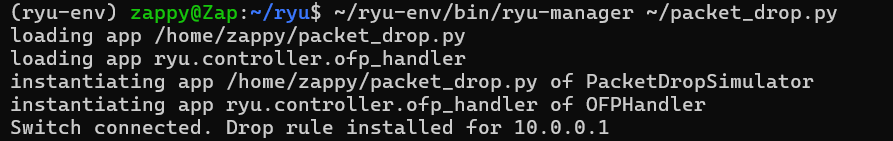
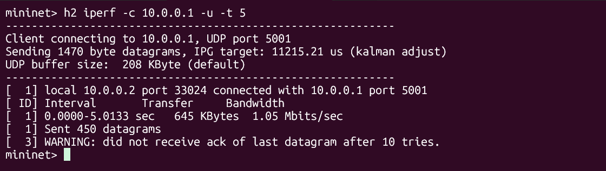

# SDN Packet Drop Simulator

## Problem Statement
Simulate selective packet dropping using SDN flow rules with Mininet and a Ryu OpenFlow controller. The controller installs a high-priority drop rule for a specific IP address, demonstrating how SDN can programmatically control network traffic at the flow level.

## Topology

```text
h1 (10.0.0.1) ---- s1 ---- h2 (10.0.0.2)
                     |
                     |
          Ryu Controller (Port 6633)
```

## SDN Logic
- Default rule (priority 0): Send all unmatched packets to controller
- Drop rule (priority 10): Drop all IP packets with source 10.0.0.1 (h1)

Higher priority rule matches first, silently discarding h1 traffic before it reaches h2.

## Setup & Installation

### Requirements
- Ubuntu 22.04 (WSL2 or VM)
- Mininet + Open vSwitch
- Python 3.11 virtual environment
- Ryu SDN controller

### Install Mininet
sudo apt install mininet -y
sudo apt install openvswitch-switch -y

### Install Ryu
sudo add-apt-repository ppa:deadsnakes/ppa -y
sudo apt update
sudo apt install python3.11 python3.11-venv -y
python3.11 -m venv ~/ryu-env
source ~/ryu-env/bin/activate
pip install setuptools==58.0.0
pip install dnspython==2.2.1
pip install eventlet==0.33.3
pip install ryu

## Running the Project

### Terminal 1 - Start Ryu Controller
source ~/ryu-env/bin/activate
~/ryu-env/bin/ryu-manager packet_drop.py

### Terminal 2 - Start Mininet
sudo service openvswitch-switch start
sudo mn --controller=remote,ip=127.0.0.1,port=6633

## Test Scenarios

### Scenario 1 - Drop rule on h1 (h1 to h2)
mininet> h1 ping h2 -c 4
Expected: 100% packet loss (drop rule matches src IP 10.0.0.1)

### Scenario 2 - Return traffic blocked (h2 to h1)
mininet> h2 ping h1 -c 4
Expected: 100% packet loss (h1 cannot reply)

### Flow Table Verification
mininet> sh ovs-ofctl dump-flows s1

Expected:
cookie=0x0, table=0, priority=10,ip,nw_src=10.0.0.1 actions=drop
cookie=0x0, table=0, priority=0 actions=CONTROLLER:65535

## Performance Observation (iperf)
mininet> h1 iperf -s &
mininet> h2 iperf -c 10.0.0.1 -u -t 5

Results:
- Bandwidth: 1.05 Mbits/sec
- 450 datagrams sent
- No ack received, confirms drop rule is active

## Regression Test
Exit Mininet and stop Ryu, then restart both and immediately run:
mininet> sh ovs-ofctl dump-flows s1

Expected: Drop rule for 10.0.0.1 reinstalls automatically on every controller reconnect, confirming rule persistence.

## Proof of Execution

### Ping Tests + Flow Table


### Ryu Controller - Drop Rule Installed


### iperf Throughput Measurement


### Regression Test - Before Restart


### Regression Test - After Restart


## References
- Mininet: https://mininet.org
- Ryu SDN Framework: https://ryu-sdn.org
- OpenFlow 1.3 Spec: https://opennetworking.org/wp-content/uploads/2014/10/openflow-spec-v1.3.0.pdf
